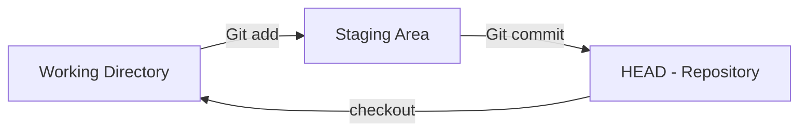

To use `Git` effectively, it’s important to understand the workflow which is broken into three parts:

* Working Directory

* Staging Area (Index)

* HEAD (Repository)

These components work together to track, orgernise, and save changes.

## Working Directory

This is the current state of your project, the files and folders you’re actively editing.

Anything you create, modify, or delete here is considered unstaged by `Git`.

## Staging Area

The Staging Area is like a clipboard or checklist of changes you want to include in your next commit, you add files from your working directory to the staging area by using the `git add` command.

## HEAD (Repository)

The `HEAD`, is the permanent history of commits. Each commit is a snapshot of the files that were staged at the time. Files are added to this area by using the `git commit` command.

## Visualizing the Git Workflow

